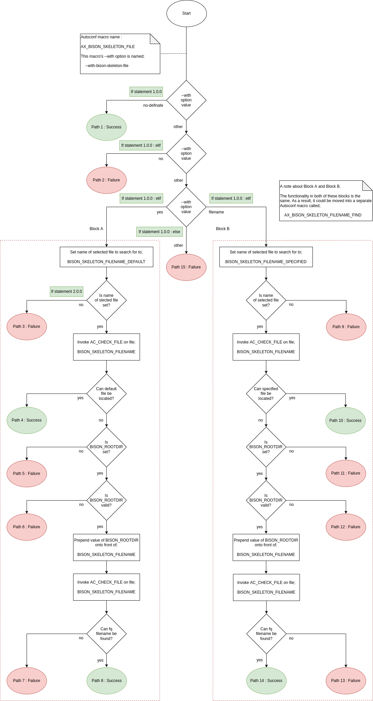

Filename : README.md


### 1) Introduction.

This package implements a GNU Autoconf macro which is called ```AX_BISON_SKELETON```. This macro can
be used to specify the Skeleton file which GNU Bison should use to build its Parser.

The macro is implemented in the file ```ax_bison_skeleton.m4```, which resides within the m4
sub-directory of this package.

It might be worth mentioning that this macro is the sole reason for this package's existence - that
is, this package wouldn't exist if it wasn't for this macro.


### 2) Purpose of the macro.

The purpose of this macro, is to ascertain if a GNU Bison Skeleton file should be used for the configuration and building of a particular project. In the case where a specific Skeleton file should be used, the name of the desired Skeleton file can be passed as an argument to this macro, using its ```--with``` configure script option.

If it is ascertained that a Skeleton file should indeed be used, and the name of one has been specified, then the ```AX_BISON_SKELETON``` macro will set an environment variable called ```BISON_SKELETON``` with the name of the Skeleton file which should be used by the project.


### 3) GNU Bison Skeleton files.

When GNU Bison creates a Parser, it doesn't do so from scratch. Instead, it uses as a starting
point, one of the Skeleton files that are distributed with the GNU Bison package. Depending upon how
GNU Bison has been installed on any particular system, one may be able to find these Skeleton files
within the following sub-directory of the location into which GNU Bison has been installed;

```
share/bison/skeletons
```

For GNU Bison 3.8, some of the Skeleton files which are available are;

- glr.cc
- glr2.cc
- lalr1.cc
- location.cc

### 4) Invoking the macro.

In order for a GNU Autotools project to use this macro properly, the project must invoke the macro
from within its ```configure.ac``` file as follows;

```
AX_BISON_SKELETON([])
```

If the GNU Autotools are able to successfully process a project which uses this macro, then they
should generate a file which is called ```configure```. This file is referred to as the configure
script for the project which it was generated for, and if the ```AX_BISON_SKELETON``` macro was able
to be successfully incorporated into this configure script by the GNU Autotools, then the
following configure script option should show up when this configure script is invoked with the
```--help``` option;

```
--with-bison-skeleton=[bison_skeleton]
                        instruct GNU Bison to use the specified Skeleton
                        file
                        (ARG=glr.cc)
```


### 5) Implementation of the macro.

#### 5.1) Design of the macro.

The macro is implemented in a rather basic fashion. It does not do anything too complex, and most of
the work is offloaded onto the GNU Autoconf macro ```AC_CHECK_PROG```.

A flowchart which depicts the basic operation of this Autoconf macro is shown below in Image 1). As you can see from this flowchart, there are 15 possible paths of execution through the macro. Six of these paths, i.e. paths 1, 4, 8, 9, 13, and 15 will result in success, while the remaining paths will result in failure.



Image 1) Flowchart which outlines the operation of the macro.


#### 5.2) Key decisions within the flowchart.

The key decisions in this flowchart are listed below, as well as being indented accordingly.

- if statement 1.0.0 (Path 1 : Success)

```
# Test if the Package configurer passed --with-bison-skeleton-file=no-definate
# to the configure script.

if test "x${WITH_BISON_SKELETON_FILE_VALUE}" == "xNO_DEFINATE"
```

- if statement 2.0.0 (Path 2 : Failure)

```
# Test if the Package configurer passed --with-bison-skeleton-file=no to the
# configure script.

elif test "x${WITH_BISON_SKELETON_FILE_VALUE}" == "xNO"
```

- if statement 3.0.0

```
# Test if the Package configurer passed --with-bison-skeleton-file=yes to the
# configure script.

elif test "x${WITH_BISON_SKELETON_FILE_VALUE}" == "xYES"
```

- if statement 3.1.0 (Path 3 : Failure)

```
    # Test if a Bison default Skeleton file has NOT been set.

    if test "x${BISON_SKELETON_DEFAULT}" == "x"
```

- if statement 3.2.0 (Path 4 : Success)

```
    # Test if the macro should NOT continue searching for a default Bison 
    # Skeleton file.
    # Test if a Bison default Skeleton file has been set.

    if test "x${BISON_SKELETON_FILE_CONTINUE_SEARCHING}" == "xNO" &&
       test "x${BISON_SKELETON_DEFAULT}"                 != "x"
```

- if statement 3.2.1 (Path 5 : Failure)

```
    # Test if the macro should continue searching for a Skeleton file.
    # Test if a Bison default Skeleton file has been set.
    # Test if a Bison root directory has NOT been set.

    if test "x${BISON_SKELETON_FILE_CONTINUE_SEARCHING}" == "xYES" &&
       test "x${BISON_SKELETON_DEFAULT}"                 != "x"    &&
       test "x${BISON_ROOTDIR}"                          == "x"    &&
```

- if statement 3.2.2

```
    # Test if the macro should continue searching for a Skeleton file.
    # Test if a Bison default Skeleton file has been set.
    # Test if a Bison root directory has been set.

    if test "x${BISON_SKELETON_FILE_CONTINUE_SEARCHING}" == "xYES" &&
       test "x${BISON_SKELETON_DEFAULT}"                 != "x"    &&
       test "x${BISON_ROOTDIR}"                          != "x"    &&
```

- if statement 3.2.2.0 (Path 6 : Failure)

```
        # Test if the value which has been specified for the Bison root
        # directory is NOT actually a directory.

        if not test -d ${BISON_ROOTDIR}
```

- if statement 3.2.2.1 (Path 7 : Failure)

```
        # Test if a Bison Skeleton file was NOT found.

        else
            if test "x${BISON_SKELETON_FILE_FOUND}" == "xNO"
```

- if statement else (Path 8 : Success)

```
            else
```

- if statement 4.0.0

```
# Test if the Package configurer passed --with-bison-skeleton=<filename> to the
# configure script.

elif test "x${WITH_BISON_SKELETON_FILE_VALUE}" == "xFILENAME"
```

- if statement 4.1.0 (Path 9 : Success)

```
    # Test if the macro should NOT continue searching for a Skeleton file.
    # Test if the name of a Bison Skeleton file has been set.

    if test "x${BISON_SKELETON_FILE_CONTINUE_SEARCHING}" == "xNO" &&
       test "x${BISON_SKELETON_FILENAME}"                != "x"
```

- if statement 4.2.0 (Path 10 : Failure)

```
    # Test if the macro should continue searching for a Skeleton file.
    # Test if the name of a Bison Skeleton file has been set.
    # Test if a Bison root directory has NOT been set.

    elif test "x${BISON_SKELETON_FILE_CONTINUE_SEARCHING}" == "xYES" &&
         test "x${BISON_SKELETON_FILENAME}"                != "x"    &&
         test "x${BISON_ROOTDIR}"                          == "x"
```

- if statement 4.3.0

```
    # Test if the macro should continue searching for a Skeleton file.
    # Test if the name of a Bison Skeleton file has been set.
    # Test if a Bison root directory has been set.

    elif test "x${BISON_SKELETON_FILE_CONTINUE_SEARCHING}" == "xYES" &&
         test "x${BISON_SKELETON_FILENAME}"                != "x"    &&
         test "x${BISON_ROOTDIR}"                          != "x"
```

- if statement 4.3.0.0 (Path 11 : Failure)
```
        # Test if the value which has been specified for the Bison root
        # directory is NOT actually a directory.

        if not test -d ${BISON_ROOTDIR}
```

- if statement 4.3.0.1 (Path 12 : Failure)

```
        # Test if a Bison Skeleton file was NOT found.

        else
            if test "x${BISON_SKELETON_FILE_FOUND}" == "xNO"
```

- if statement else (Path 13 : Success)

```
            else
```

- if statement else

```
else

    # The macro should not be able to get here.
    #
    # If it did, not sure how it did.
```


#### 5.2.1) Condensed version of above with comments.

```
if   test "x${WITH_BISON_SKELETON_FILE_VALUE}" == "xNO_DEFINATE"

    # ----------------
    # Path 1 : Success
    # ----------------

elif test "x${WITH_BISON_SKELETON_FILE_VALUE}" == "xNO"

    # ----------------
    # Path 2 : Failure
    # ----------------

elif test "x${WITH_BISON_SKELETON_FILE_VALUE}" == "xYES"

    if   test "x${BISON_SKELETON_DEFAULT}" == "x"

        # ----------------
        # Path 3 : Failure
        # ----------------

    fi

    if   test "x${BISON_SKELETON_FILE_CONTINUE_SEARCHING}" == "xNO" &&
         test "x${BISON_SKELETON_DEFAULT}"                 != "x"

        # ----------------
        # Path 4 : Success
        # ----------------

    elif test "x${BISON_SKELETON_FILE_CONTINUE_SEARCHING}" == "xYES" &&
         test "x${BISON_SKELETON_DEFAULT}"                 != "x"    &&
         test "x${BISON_ROOTDIR}"                          == "x"    &&

        # ----------------
        # Path 5 : Failure
        # ----------------

    elif test "x${BISON_SKELETON_FILE_CONTINUE_SEARCHING}" == "xYES" &&
         test "x${BISON_SKELETON_DEFAULT}"                 != "x"    &&
         test "x${BISON_ROOTDIR}"                          != "x"    &&

        if not test -d ${BISON_ROOTDIR}

            # ----------------
            # Path 6 : Failure
            # ----------------

        else

            AC_CHECK_FILE

            if test "x${BISON_SKELETON_FILE_FOUND}" == "xNO"

                # ----------------
                # Path 7 : Failure
                # ----------------

            else

                # ----------------
                # Path 8 : Success
                # ----------------

            fi
        fi
    fi

elif test "x${WITH_BISON_SKELETON_FILE_VALUE}" == "xFILENAME"

    AC_CHECK_FILENAME

    if   test "x${BISON_SKELETON_FILE_CONTINUE_SEARCHING}" == "xNO" &&
         test "x${BISON_SKELETON_FILENAME}"                != "x"

        # ----------------
        # Path 9 : Success
        # ----------------

    elif test "x${BISON_SKELETON_FILE_CONTINUE_SEARCHING}" == "xYES" &&
         test "x${BISON_SKELETON_FILENAME}"                != "x"    &&
         test "x${BISON_ROOTDIR}"                          == "x"

        # -----------------
        # Path 10 : Failure
        # -----------------

    elif test "x${BISON_SKELETON_FILE_CONTINUE_SEARCHING}" == "xYES" &&
         test "x${BISON_SKELETON_FILENAME}"                != "x"    &&
         test "x${BISON_ROOTDIR}"                          != "x"

        if not test -d ${BISON_ROOTDIR}

            # -----------------
            # Path 11 : Failure
            # -----------------

        else

            AC_CHECK_FILE

            if test "x${BISON_SKELETON_FILE_FOUND}" == "xNO"

                # -----------------
                # Path 12 : Failure
                # -----------------

            else

                # -----------------
                # Path 13 : Failure
                # -----------------

            fi
        fi
    fi
else

fi
```

#### 5.3) Code implementation of the macro.

As at 27 May 2022, the macro was implemented as follows;

```
001 # ------------------------------------------------------------------------------
002 # Macro : AX_BISON_SKELETON
003 # =========================
004 #
005 # This macro can be used to instruct the GNU Autotools on which Skeleton file
006 # GNU Bison should use.
007 #
008 # ------------------------------------------------------------------------------
009 #
010 # Dependencies :
011 #
012 # This macro may require that the following macro(s) be executed first.
013 #
014 #   - AX_BISON_ROOTDIR
015 #
016 # ------------------------------------------------------------------------------
017 # Explanation of values which can be passed to this macro's --with option.
018 #
019 #   yes :
020 #
021 #   This value indicates that the Package configurer wants to use a Bison
022 #   Skeleton file. Since the Package configurer hasn't specified an exact Bison
023 #   Skeleton file to use, use the default Bison Skeleton file which has been
024 #   specified by the Package maintainer in the package's configure.ac file.
025 #
026 #   no :
027 #
028 #   This value indicates that the Package configurer does not want to use a
029 #   Bison Skeleton file. There is a problem with this, and that is that the
030 #   package needs to use a Bison Skeleton file. As a result, this macro will
031 #   exit with a failure, informing the Package configurer of the problem.
032 #
033 #   Any other value :
034 #
035 #   This macro will assume that any value other than yes or no is the name of a
036 #   Bison Skeleton file.
037 #
038 # Note :
039 #
040 # This macro does not check to see if the Bison Skeleton file which is
041 # ultimately selected by it, actually exists.
042 # ------------------------------------------------------------------------------
043 # There are 11 execution paths through this macro.
044 #
045 #   - 6 : Failure paths  (Path nums : 1,2,3,6,7,10)
046 #   - 5 : Success paths  (Path nums : 4,5,8,9,11)
047 #
048 # Execution path 1 :
049 #   - --with-bison-skeleton=no
050 #
051 # Execution path 2 :
052 #   - --with-bison-skeleton=yes
053 #   - Default Skeleton file NOT set.
054 #
055 # Execution path 3 :
056 #   - --with-bison-skeleton=yes
057 #   - Default Skeleton file set.
058 #   - Default Skeleton file cannot be found when not using Bison root directory.
059 #   - Default Skeleton file cannot be found when using Bison root directory.
060 #
061 # Execution path 6 :
062 #   - --with-bison-skeleton=filename
063 #   - Supplied filename is NOT fully qualified.
064 #   - Default Skeleton file cannot be found when not using Bison root directory.
065 #   - Bison root directory is not set.
066 #
067 # Execution path 7 :
068 #   - --with-bison-skeleton=filename
069 #   - Supplied filename is NOT fully qualified.
070 #   - Supplied filename cannot be found when not using Bison root directory.
071 #   - Bison root directory is set.
072 #   - Supplied filename cannot be found when using Bison root directory.
073 #
074 # Execution path 10 :
075 #   - --with-bison-skeleton=filename
076 #   - Supplied filename is fully qualified.
077 #   - Supplied filename cannot be found.
078 #
079 # ------------------------------------------------------------------------------
080 
081 
082 AC_DEFUN(
083 
084   [AX_BISON_SKELETON],
085 
086   [
087     # Save the value which was passed to this macro's $1 variable.
088     #
089     # The reason for doing this is because other code within the body of this
090     # macro uses this same variable and thus overwrites its value.
091     #
092     # If $1 == "", i.e. it is not set / set to an empty string, then this will
093     # be a problem if the Package configurer passes a value of "yes" to this
094     # macro's --with option.
095 
096     BISON_SKELETON_DEFAULT=$1
097 
098 
099     # Enable and setup this macro's --with option.
100 
101     AC_ARG_WITH(
102       [bison-skeleton],
103       [
104 AS_HELP_STRING(
105 [--with-bison-skeleton=<yes|no|FILENAME>],
106 [instruct GNU Bison which Skeleton file to use (ARG=bison_skeleton)]
107 )
108       ],
109       [BISON_SKELETON=${withval}]
110     )
111 
112     # Set the value of the variable BISON_SKELETON.
113     #
114     # Exactly what it is set to, will depend upon the value which was passed to
115     # this macro's --with option.
116 
117     AS_CASE(
118       [${with_bison_skeleton}],
119       [no-definate],
120       [
121         ############################
122         ############################
123         # Execution path 1 : Success
124         ############################
125         ############################
126 
127         AC_MSG_WARN([================================================================================])
128         AC_MSG_WARN(["You have deliberately specified that a Bison Skeleton file not be used!"])
129         AC_MSG_WARN([""])
130         AC_MSG_WARN(["This is fine, however this package requires a Bison Skeleton file."])
131         AC_MSG_WARN([""])
132         AC_MSG_WARN(["It is assumed that you know what you doing, therefore this macro will not issue"])
133         AC_MSG_WARN(["an error."])
134         AC_MSG_WARN([================================================================================])
135       ],
136       [no],
137       [
138         ############################
139         ############################
140         # Execution path 2 : Failure
141         ############################
142         ############################
143 
144         AC_MSG_WARN([================================================================================])
145         AC_MSG_WARN([The configure script has encountered a problem :])
146         AC_MSG_WARN([------------------------------------------------])
147         AC_MSG_WARN([])
148         AC_MSG_WARN([================================================================================])
149         AC_MSG_WARN
150         AC_MSG_FAILURE(["You have to specify a Bison Skeleton file to use!"])
151       ],
152       [yes],
153       [
154         if test "x${BISON_SKELETON_DEFAULT}" == "x"
155         then
156 
157           ############################
158           ############################
159           # Execution path 3 : Failure
160           ############################
161           ############################
162 
163           AC_MSG_WARN([================================================================================])
164           AC_MSG_WARN([The configure script has encountered a problem :])
165           AC_MSG_WARN([------------------------------------------------])
166           AC_MSG_WARN([])
167           AC_MSG_WARN([  > The Package maintainer has NOT specified a default GNU Bison Skeleton file])
168           AC_MSG_WARN([    in this package's configure.ac file.])
169           AC_MSG_WARN([  > The Package configurer has NOT specified a GNU Bison Skeleton file, they])
170           AC_MSG_WARN([    have only specified --with-bison-skeleton=yes])
171           AC_MSG_WARN([])
172           AC_MSG_WARN([As a result of this shortcoming in information, the configuration system will be])
173           AC_MSG_WARN([unable to tell the build system which GNU Bison Skeleton file it should use.])
174           AC_MSG_WARN([])
175           AC_MSG_WARN([To rectify this problem, try running the configure script again. This time])
176           AC_MSG_WARN([however, consider passing the name of a valid GNU Bison Skeleton file as an])
177           AC_MSG_WARN([argument to the --with-bison-skeleton configure script option. That is, invoke])
178           AC_MSG_WARN([the --with-bison-skeleton configure script option in a manner which is similar])
179           AC_MSG_WARN([to the following;])
180           AC_MSG_WARN([])
181           AC_MSG_WARN([  --with-bison-skeleton="lalr1.cc"])
182           AC_MSG_WARN([])
183           AC_MSG_WARN([Due to this problem which has been encountered - and hopefully explained clearly])
184           AC_MSG_WARN([above, the configure script is about to exit with a failure.])
185           AC_MSG_WARN([================================================================================])
186           AC_MSG_FAILURE(["Exiting out of the configure script with a failure!!!"])
187         else
188           BISON_SKELETON=${BISON_SKELETON_DEFAULT}
189         fi
190       ],
191       [BISON_SKELETON=${with_bison_skeleton}]
192     )
193 
194     # If execution of the macro has reached this point, then the variable BISON_SKELETON
195     # should be set to the name of a GNU Bison Skeleton file.
196     #
197     # The name of the GNU Bison Skeleton file, may or may not be fully qualified. Check
198     # to see if the file actually exists.
199 
200     # Case 1 : Assume the value of BISON_SKELETON is fully qualified.
201 
202     BISON_SKELETON_TEMP=${BISON_SKELETON}
203 
204     AC_CHECK_FILE(
205       [${BISON_SKELETON_TEMP}],
206       [
207         ############################
208         ############################
209         # Execution path 4 : Success
210         ############################
211         ############################
212 
213         AC_MSG_NOTICE([Found the GNU Bison Skeleton file : ${BISON_SKELETON_TEMP}])
214       ],
215       [
216         AC_MSG_NOTICE([Could not find the GNU Bison Skeleton file : ${BISON_SKELETON_TEMP}])
217       ]
218     )
219 
220     # Case 2: Assume the value of BISON_SKELETON is not fully qualified.
221     #
222     # Fully qualify BISON_ROOTDIR.
223     #
224     # Note that it is assumed the GNU Bison Skeleton file will reside in ...
225 
226     BISON_SKELETON_TEMP=${BISON_ROOTDIR}/share/bison/skeletons/${BISON_SKELETON}
227 
228     AC_CHECK_FILE(
229       [${BISON_SKELETON_TEMP}],
230       [
231         AC_MSG_NOTICE([Found the GNU Bison Skeleton file : ${BISON_SKELETON_TEMP}])
232       ],
233       [
234         # Maybe change the test below to the following;
235         #
236         #   if test "x${BISON_ROOTDIR}" == "x" || not test -d ${BISON_ROOTDIR}
237         #
238         # This states that if BISON_ROOTDIR is an empty string or it is not an empty string,
239         # but it is set to a value which is not a valid directory, then the test should fail.
240 
241         if test "x${BISON_ROOTDIR}" == "x"
242         then
243 
244           ############################
245           ############################
246           # Execution path 3 : Failure
247           ############################
248           ############################
249 
250           # The variable BISON_ROOTDIR has NOT been set.
251 
252           AC_MSG_WARN([================================================================================])
253           AC_MSG_WARN([The configure script has encountered a problem :])
254           AC_MSG_WARN([------------------------------------------------])
255           AC_MSG_WARN([])
256           AC_MSG_WARN([  > The specified GNU Bison Skeleton file could NOT be found.])
257           AC_MSG_WARN([  > The variable BISON_ROOTDIR is NOT set. As a result of this,])
258           AC_MSG_WARN([    the configure script might not be able to find some or all of the components])
259           AC_MSG_WARN([    of GNU Bison that it requires.])
260           AC_MSG_WARN([])
261           AC_MSG_WARN([As a result of this, the configuration system will be unable to tell the build])
262           AC_MSG_WARN([system which GNU Bison Skeleton file it should use.])
263           AC_MSG_WARN([])
264           AC_MSG_WARN([To rectify this problem, try running the configure script again. This time])
265           AC_MSG_WARN([however, consider performing the following action;])
266           AC_MSG_WARN([])
267           AC_MSG_WARN([  - passing the fully qualified name of the directory into which a GNU Bison])
268           AC_MSG_WARN([    package has been installed, as an argument to the --with-bison-rootdir])
269           AC_MSG_WARN([    configure script option. That is, invoke the --with-bison-rootdir configure])
270           AC_MSG_WARN([    script option in a manner which is similar to the following;])
271           AC_MSG_WARN([])
272           AC_MSG_WARN([      --with-bison-rootdir=/home/foo/bison-3.8])
273           AC_MSG_WARN([])
274           AC_MSG_WARN([Due to this problem which has been encountered - and hopefully explained clearly])
275           AC_MSG_WARN([above, the configure script is about to exit with a failure.])
276           AC_MSG_WARN([================================================================================])
277           AC_MSG_FAILURE(["Exiting out of the configure script with a failure!!!"])
278 
279         else
280 
281           # The variable BISON_ROOTDIR has been set. But has it been set to a valid value?
282 
283           if test -d ${BISON_ROOTDIR}
284           then
285 
286             # The value specified in BISON_ROOTDIR does actually exist and it is actually
287             # a valid directory.
288 
289             AC_MSG_WARN([================================================================================])
290             AC_MSG_WARN([The configure script has encountered a problem :])
291             AC_MSG_WARN([------------------------------------------------])
292             AC_MSG_WARN([])
293             AC_MSG_WARN([  > The specified GNU Bison Skeleton file could NOT be found.])
294             AC_MSG_WARN([  > The variable BISON_ROOTDIR is set, but has it been set to a valid value?])
295             AC_MSG_WARN([])
296             AC_MSG_WARN([As a result of this, the configuration system will be unable to tell the build])
297             AC_MSG_WARN([system which GNU Bison Skeleton file it should use.])
298             AC_MSG_WARN([])
299             AC_MSG_WARN([To rectify this problem, try running the configure script again. This time])
300             AC_MSG_WARN([however, consider performing one of the following two actions;])
301             AC_MSG_WARN([])
302             AC_MSG_WARN([  - passing the fully qualified name of the directory into which a GNU Bison])
303             AC_MSG_WARN([    package has been installed, as an argument to the --with-bison-rootdir])
304             AC_MSG_WARN([    configure script option. That is, invoke the --with-bison-rootdir configure])
305             AC_MSG_WARN([    script option in a manner which is similar to the following;])
306             AC_MSG_WARN([])
307             AC_MSG_WARN([      --with-bison-rootdir=/home/foo/bison-3.8])
308             AC_MSG_WARN([])
309             AC_MSG_WARN([  - passing the fully qualified name of a specific GNU Bison Skeleton file, as])
310             AC_MSG_WARN([    an argument to the --with-bison-skeleton configure script option. That is,])
311             AC_MSG_WARN([    invoke the --with-bison-skeleton configure script option in a manner which])
312             AC_MSG_WARN([    is similar to the following;])
313             AC_MSG_WARN([])
314             AC_MSG_WARN([      --with-bison-skeleton=/home/foo/bison-3.8/share/bison/skeletons/lalr1.cc])
315             AC_MSG_WARN([])
316             AC_MSG_WARN([Due to this problem which has been encountered - and hopefully explained clearly])
317             AC_MSG_WARN([above, the configure script is about to exit with a failure.])
318             AC_MSG_WARN([================================================================================])
319             AC_MSG_FAILURE(["Exiting out of the configure script with a failure!!!"])
320 
321           else
322 
323             # The value specified in BISON_ROOTDIR does NOT exist.
324 
325             AC_MSG_WARN([================================================================================])
326             AC_MSG_WARN([The configure script has encountered a problem :])
327             AC_MSG_WARN([------------------------------------------------])
328             AC_MSG_WARN([])
329             AC_MSG_WARN([  > The specified GNU Bison Skeleton file could NOT be found.])
330             AC_MSG_WARN([  > The variable BISON_ROOTDIR is actually set, but unfortunately it has been])
331             AC_MSG_WARN([    set to the name of a directory which doesn't actually exist!])
332             AC_MSG_WARN([])
333             AC_MSG_WARN([As a result of this, the configuration system will be unable to tell the build])
334             AC_MSG_WARN([system which GNU Bison Skeleton file it should use.])
335             AC_MSG_WARN([])
336             AC_MSG_WARN([To rectify this problem, try running the configure script again. This time])
337             AC_MSG_WARN([however, consider performing the following action;])
338             AC_MSG_WARN([])
339             AC_MSG_WARN([  - passing the fully qualified name of the directory into which a GNU Bison])
340             AC_MSG_WARN([    package has been installed, as an argument to the --with-bison-rootdir])
341             AC_MSG_WARN([    configure script option. That is, invoke the --with-bison-rootdir configure])
342             AC_MSG_WARN([    script option in a manner which is similar to the following;])
343             AC_MSG_WARN([])
344             AC_MSG_WARN([      --with-bison-rootdir=/home/foo/bison-3.8])
345             AC_MSG_WARN([])
346             AC_MSG_WARN([Due to this problem which has been encountered - and hopefully explained clearly])
347             AC_MSG_WARN([above, the configure script is about to exit with a failure.])
348             AC_MSG_WARN([================================================================================])
349             AC_MSG_FAILURE(["Exiting out of the configure script with a failure!!!"])
350 
351           fi
352 
353         fi
354 
355         AC_MSG_FAILURE([Could not find the GNU Bison Skeleton file : ${BISON_SKELETON_TEMP}])
356       ]
357     )
358 
359     # Instruct GNU Autoconf to register the variable BISON_SKELETON.
360     #
361     # This registers the variable and its value, with the configure script. By
362     # doing this, it allows the rest of the configure script to see and thus use
363     # this variable.
364 
365     AC_SUBST(BISON_SKELETON)
366 
367     AC_MSG_NOTICE([BISON_SKELETON = ${BISON_SKELETON}])
368   ]
369 )
```

- ```BISON_SKELETON_DEFAULT=$1```

```$1``` holds the value of the first command line argument which was passed to this macro. The macro should save this value into the variable ```BISON_SKELETON_DEFAULT```, because other code within the body of this macro also uses the ```$1``` variable, and if it doesn't save its value, then it will be lost.

When this macro is first invoked, ```$1``` will contain the value which was passed to it, when it was invoked from a package's ```configure.ac``` file. 

- ```AC_DEFUN```

This is what is actually responsible for the definition of the macro.

1) The first argument on line 38 declares the name of the macro which is being defined, i.e.
```AX_BISON_SKELETON```.

2) The second argument on lines 40-87, defines the body of the macro.


- ```AC_ARG_WITH```

This instructs GNU Autoconf to make a ```--with``` option available for this macro. This ```--with``` option will be available from any configure script that uses this macro. For reasons that will be explained in a moment, the exact name of this macro's ```--with``` option is ```--with-bison-skeleton```.

1) The first argument on line 52 declares the specific name which will be associated with this macro. The value of this first argument is used to help form the name of the ```--with``` option which will be associated with this macro. Seeing as the value specified here is ```bison-skeleton```, the name of the resulting ```--with``` option for this macro will be ```--with-bison-skeleton```.

2) The second argument on lines 53-58 define how the usage for the ```--with-bison-skeleton``` option will be presented to the user of the configure script.

3) The third argument on line 59 specifies what actions the macro should take if the user of the configure script passes a value to the ```--with-bison-skeleton``` option.


- ```AS_CASE```

This implements a switch statement, which is based upon the value that was passed to the ```--with-bison-skeleton``` option by the user of the configure script. The actions that the macro performs, are also dependent upon this same value.
 
1) The first argument on line 68 instructs the macro as to what value it should make its decision on.

2) The second and third arguments on lines 69 and 70, state that if a value of ```yes``` was passed as an argument to the ```--with-bison-skeleton``` option, then the value of the variable ```BISON_SKELETON``` should be set to the default value of ```BISON_SKELETON_DEFAULT```.

3) The fourth and fifth arguments on lines 71-74, state that if a value of ```no``` was passed as an argument to the ```--with-bison-skeleton``` option, then a failure message should be presented to the person running the configure script. A failure message means that the configure script will display the specified message and then terminate with a failure. The reason for this is because the user of the configure script has elected not to stipulate a Skeleton file - and this is a problem, because the project which is being configured needs to use a Skeleton file.

4) The sixth argument on line 75 instructs the macro to set the environment variable ```BISON_SKELETON``` to the value which was passed to the ```--with-bison-skeleton``` option by the user of the configure script. This macro does not check to see if the value which was passed to this option is valid or not, so the user of the configure script needs to be careful as to what values they pass it!


### 6) Behaviour of the macro

- By the person maintaining the package

- By the person maintaining the package

### 7) Usage of the macro

- By the person maintaining the package

If the project which is to be configured by the GNU Autotools, does - or even might, need the user running the configure script to specify which GNU Bison Skeleton file should be used, then this macro will need to be invoked from within the package's ```configure.ac``` file.

It should be invoked from within the package's ```configure.ac``` file in a manner which is similar to the following;

```
AX_BISON_SKELETON(["glr.c"])
```

Notice how the macro is invoked with an argument, in this case the value ```"glr.cc"```. If such an argument is specified by the package maintainer, then this will be used by the macro as the default value for the GNU Bison Skeleton file. That is, if the user of the configure script doesn't invoke the ```--with-bison-skeleton``` configure script option, then ...

- By the person configuring the package

If the person who is configuring the package wants to explicitly set the GNU Bison Skeleton file which is to be used by the package, then they will need 

An example invocation is shown below;

```
configre ... --with-bison-skeleton=/usr/local/bison-3.8/share/bison/skeletons/glr.c
```


